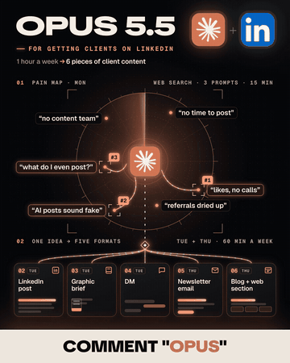
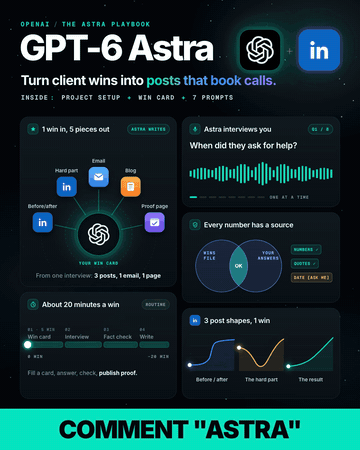
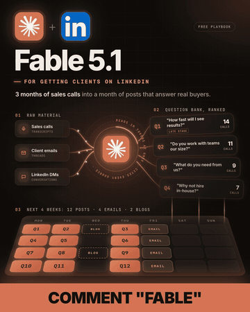
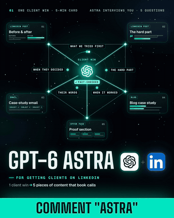
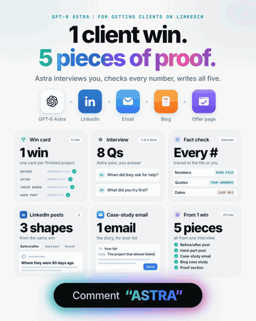
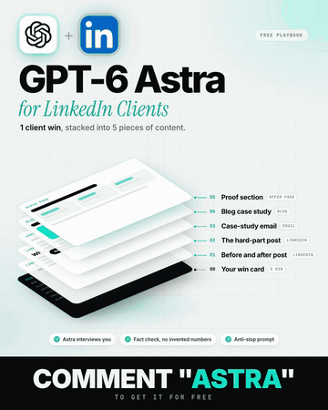

<h1 align="center">LinkedIn GIF Post</h1>

<p align="center"><strong>Turn the resource you want to share into a LinkedIn post people stop for: a looping GIF in your brand and a caption that sells the click.</strong></p>

<p align="center">
  
  <a href="LICENSE"></a>
  
  = 22">
  = 3.9">
  <a href="https://github.com/heygen-com/hyperframes"></a>
</p>

<table>
  <tr>
    <td align="center"><br><sub><b>Radar</b> · a scan finds the pains, the model turns them into formats</sub></td>
    <td align="center"><br><sub><b>Star bento</b> · five live cards, nothing ever clears</sub></td>
    <td align="center"><br><sub><b>Core</b> · sources in, a month of posts out on a 3D calendar</sub></td>
  </tr>
  <tr>
    <td align="center"><br><sub><b>Constellation</b> · one input, five outputs, a camera push</sub></td>
    <td align="center"><br><sub><b>Light bento</b> · app-style cards on a light canvas</sub></td>
    <td align="center"><br><sub><b>Stack</b> · an interview, then layers that explode up in 3D</sub></td>
  </tr>
</table>

<p align="center"><sub>Graphics made with this method for real LinkedIn posts. The full GIFs are 1080x1350; these previews are scaled down.</sub></p>

A Claude Code skill for anyone who shares research, checklists, guides or playbooks on LinkedIn and gets little back. It reads the resource and your website, then builds an animated graphic that previews what the resource contains, as a living system in your colors and fonts. It renders the graphic locally with [HyperFrames](https://github.com/heygen-com/hyperframes), checks it against LinkedIn's limits, and rewrites the caption so the first two lines say what the reader gets.

It comes out of a real production: a frame-by-frame study of eight high-performing lead-magnet posts and 192 posts by their authors, then a week of posts made, measured and remade. Every rule in it exists because a version without it did worse.

> [!IMPORTANT]
> **Alpha.** The skill, the scripts and the `research_bento` template work end to end on macOS, and the gates pass on every graphic above. Only `research_bento` ships as a template so far. The other styles in the gallery were built with the same method and are on the [Roadmap](#roadmap).

## Installation

### 1. Get the skill

```bash
git clone https://github.com/josueh04/linkedin-gif-post-skill.git
cp -R linkedin-gif-post-skill/skills/linkedin-gif-post ~/.claude/skills/
pip install pillow numpy
```

To keep the skill inside one project, copy it into that project's `.claude/skills/` instead.

<details>
<summary><strong>What you need</strong></summary>

| Need | Detail |
|---|---|
| macOS | Linux should work (untested) |
| Claude Code | Any version with skills |
| Node.js | 22 or newer (HyperFrames requires it) |
| Python | 3.9 or newer, with Pillow and numpy |
| ffmpeg | `brew install ffmpeg` on macOS |
| Google Chrome | HyperFrames renders through it |

</details>

### 2. Ask for a post

In Claude Code:

```
Make a LinkedIn GIF post for this research: https://your-site.com/research/your-piece
Our site is https://your-site.com
```

The skill:
- reads the resource;
- extracts your brand into `brand.json` and shows it to you;
- builds the animation and shows you a contact sheet before it renders;
- renders and gates the GIF;
- writes the caption.

You get `graphic.gif`, `graphic-frame.png` and `caption.md` in `posts/<slug>/`.

### 3. Or run it by hand

```bash
cd ~/.claude/skills/linkedin-gif-post
python3 scripts/brand_extract.py https://your-site.com --out posts/my-post
python3 scripts/new_animation.py --out posts/my-post --brand posts/my-post/brand.json
# edit posts/my-post/animation/index.html: header, cards, CTA
python3 scripts/snapshot_sheet.py posts/my-post/animation
python3 scripts/render_gif.py posts/my-post/animation
python3 scripts/gif_gate.py posts/my-post/graphic.gif
```

## Why This Skill Exists

### #1: The Image Repeats the Caption

**The Problem.** Most resource posts use a static text card or a stock photo, which gives the scroll no reason to stop and the reader no preview of the resource.

**The Fix.** The GIF shows the resource itself as a working system. A method appears as a line of stations, the checklist is scanned row by row, and the data is called out pair by pair. The cards are dense on purpose: dense enough to read as a lot of value, too detailed to absorb in the feed.

### #2: The First Two Lines Waste the Preview

**The Problem.** LinkedIn shows about 210 characters before "...see more". Captions spend them on context, a quote chain or a thesis, and the offer shows up in paragraph three.

**The Fix.** [`copy.md`](skills/linkedin-gif-post/references/copy.md) puts the reader's stake in line 1, one number per line with its meaning, and a numbered list that mirrors the GIF's cards. Lead-magnet captions with a numbered list drew 1.53x their author's usual comments.

### #3: Animation That Looks Cheap or Breaks LinkedIn's Limits

**The Problem.** A screen recording turned into a GIF can be 10 MB and over LinkedIn's 250-frame limit. It can open on a blank frame and cut visibly at the loop.

**The Fix.** Compositions are HTML with a GSAP timeline, rendered deterministically. [`gif_gate.py`](skills/linkedin-gif-post/scripts/gif_gate.py) blocks a GIF unless it passes all eight gates: frames, bytes, size, the loop flag, fps, a seamless loop, enough motion, and a solid CTA band. When a GIF runs heavy, [`weight_map.py`](skills/linkedin-gif-post/scripts/weight_map.py) shows which area costs the bytes.

### #4: Off-Brand Graphics

**The Problem.** Templates come in someone else's colors and fonts, and a near-copy of a competitor's post reads as a copy.

**The Fix.** [`brand_extract.py`](skills/linkedin-gif-post/scripts/brand_extract.py) reads your site's CSS variables, palette, fonts and wordmark, and downloads the fonts (OFL) so renders stay local. Every color and font in the template is a token. [`analyze_reference.py`](skills/linkedin-gif-post/scripts/analyze_reference.py) measures a post you admire, so you can borrow the principle, not the layout.

## What's Inside

- **[SKILL.md](skills/linkedin-gif-post/SKILL.md)**: the workflow, from reading the resource to checking the live post, and the rules with their reasons.
- **Scripts**
  - [`brand_extract.py`](skills/linkedin-gif-post/scripts/brand_extract.py): colors, fonts and logo from a website, into `brand.json`.
  - [`new_animation.py`](skills/linkedin-gif-post/scripts/new_animation.py): copies a template into a post folder and applies the brand tokens.
  - [`snapshot_sheet.py`](skills/linkedin-gif-post/scripts/snapshot_sheet.py): ten moments of the loop on one sheet, to review before rendering.
  - [`render_gif.py`](skills/linkedin-gif-post/scripts/render_gif.py): renders with HyperFrames and encodes the GIF. If the file is too heavy, it steps down colors, dithering, fps and width.
  - [`gif_gate.py`](skills/linkedin-gif-post/scripts/gif_gate.py): the eight release gates.
  - [`weight_map.py`](skills/linkedin-gif-post/scripts/weight_map.py): where a GIF spends its bytes.
  - [`analyze_reference.py`](skills/linkedin-gif-post/scripts/analyze_reference.py): stats, a frame sheet and a motion heat map of any public LinkedIn post.
- **Template**: [`research_bento`](skills/linkedin-gif-post/references/template.md), a 10 s ambient loop with four cards: a method line, a checklist, grouped bars and a share grid.
- **References**: [design](skills/linkedin-gif-post/references/design.md), [copy](skills/linkedin-gif-post/references/copy.md), [HyperFrames notes](skills/linkedin-gif-post/references/hyperframes.md), [evidence](skills/linkedin-gif-post/references/evidence.md).

## What You Need to Provide

| Input | Required? | How |
|---|---|---|
| The resource | Yes | A URL or a file: the research, checklist, guide or playbook the post shares |
| Your website | Recommended | A URL; the brand is read from its CSS. Without it, you edit the tokens by hand |
| A logo file | Optional | An SVG or PNG. Without it, the template uses your wordmark as text |
| A post you admire | Optional | A LinkedIn URL for `analyze_reference.py` |

> [!NOTE]
> Everything renders on your machine. The scripts turn off HyperFrames' anonymous telemetry (`DO_NOT_TRACK=1`) and unset `GEMINI_API_KEY`, so no frames leave the machine. `brand_extract.py` fetches only the site you give it and the Fontsource CDN. Claude reads the resource you share, so it is sent to the model as context.

## Roadmap

| Phase | What | Status |
|---|---|---|
| 1. Core | The skill, the scripts, `research_bento`, brand extraction, caption rules and the gates | Done on macOS |
| 2. More templates | Radar, core, constellation and stack as brand-token templates, like the gallery | Next |
| 3. Pilot | Someone outside the project, with their own brand and resource | Next |
| 4. Distribution | A Claude Code plugin and `npx skills add` | Later |

## License

[MIT](LICENSE). The bundled fonts are under the SIL Open Font License 1.1 ([licenses](skills/linkedin-gif-post/assets/templates/research_bento/fonts/licenses/)). It is built on [HyperFrames](https://github.com/heygen-com/hyperframes) by HeyGen (Apache-2.0) and GSAP, which run at render time and are not bundled. The logos in the gallery belong to their owners and appear only as examples of output.
